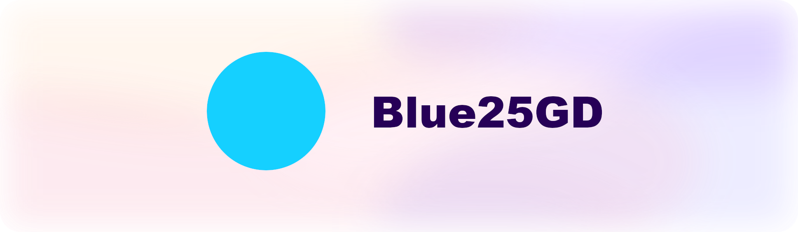

<picture>
  <source media="(prefers-color-scheme: dark)" srcset="./banner.png">
  <source media="(prefers-color-scheme: light)" srcset="./banner.png">
  
</picture>

# 👋 Hi, I'm Blue25.
I'm a student who is interested in programming and game development.

> Check out my latest project:
> 
> [3D Rendering engine using OpenGL (LWJGL)](https://github.com/Blue25GD/3DRendering)

## ✨ Skills

> What can I do?

### General

- Web devlopment
    - Preact/JSX
    - Javascript/Typescript
    - PHP
- UI/Graphic Design
    - CSS/HTML
- Game Development
    - Java

## 👾 Software
> What's on my computer?

- IDE: [JetBrains tools](https://jetbrains.com/)
- Design Software: [Figma](https://figma.com)
- Browser: [Safari](https://www.apple.com/safari/)

## 📈 Stats

